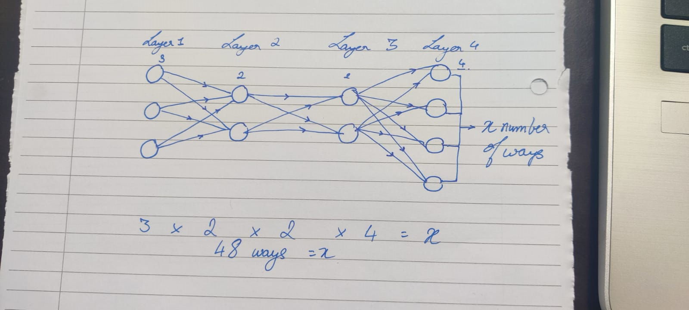

# NFT-generator

This is an NFT art generator that uses a layer by layer algorithm to generate artworks created by Komandur Sridhar Sreevatsan. 
Note to self: To generate n number of images run 
> node index.js <-number of art images you want to generate-> 

Example : node index.js 3 will give me 3 art pieces.
## Math involved

